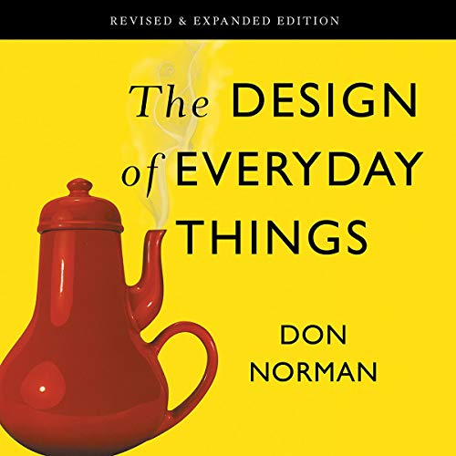
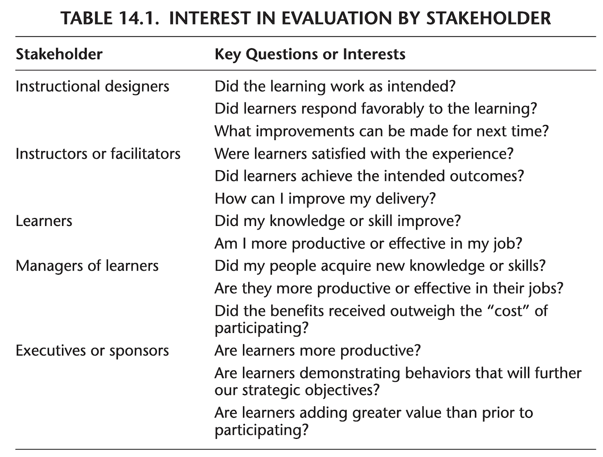
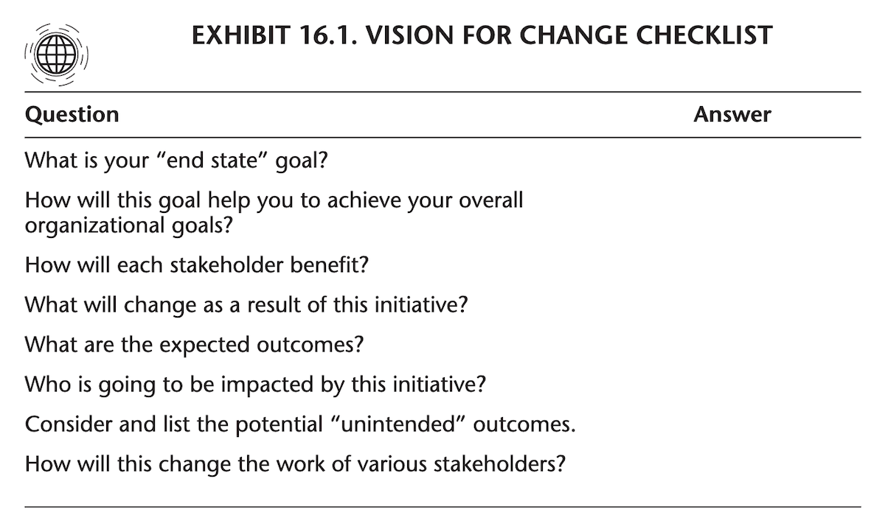

```{r setup, include=FALSE}
usethis::use_git_ignore(c("*.csv", "*.rds"))
options(htmltools.dir.version = FALSE)

library(knitr)
library(tidyverse)
library(xaringan)
library(fontawesome)
```

class: inverse, center, middle

# `r fa("fas fa-images", fill = "#fff")`

**View the slides:** 

[bretsw.com/eme5601-fs24-module7](https://bretsw.com/eme5601-fs24-module7)

---

class: inverse, center, middle

# `r fa("fas fa-mug-hot", fill = "#fff")` <br><br> Module 6 <br> Recap

---

# `r fa("fas fa-mug-hot", fill = "#fff")` Design & Development

Design & Development are **late steps** in the iterative design cycle:

```{r, out.width = "480px", echo = FALSE, fig.align = "center"}
include_graphics("img/Rothwell-fig2-1.png")
```

<div class="caption">
Figure 2.1 from Rothwell et al. (2016, p. 20)
<br><br>
</div>

---

# `r fa("fas fa-mug-hot", fill = "#fff")` Design & Development

```{r, out.width = "480px", echo = FALSE, fig.align = "center"}

```

---

class: inverse, center, middle

#  `r fa("fas fa-leaf", fill = "#fff")` <br><br> Module 7 <br> Evaluation

---

# `r fa("fas fa-leaf", fill = "#fff")` Evaluation

```{r, out.width = "100%", echo = FALSE, fig.align = "center"}
include_graphics("img/girl-leaf.png")
```

---

# `r fa("fas fa-leaf", fill = "#fff")` Evaluation

```{r, out.width = "100%", echo = FALSE, fig.align = "center"}

```

---

# `r fa("fas fa-leaf", fill = "#fff")` Evaluation

```{r, out.width = "600px", echo = FALSE, fig.align = "center"}

```

**"Blind Monks Examining an Elephant" by Itcho Hanabusa (1652–1724).** 

Image is in the public domain, hosted by [Wikimedia Commons](https://commons.wikimedia.org/wiki/File:Blind_monks_examining_an_elephant.jpg)

---

# `r fa("fas fa-leaf", fill = "#fff")` Evaluation

```{r, out.width = "420px", echo = FALSE, fig.align = "center"}

```

[Blind Men and An Elephant](https://en.wikipedia.org/wiki/Blind_men_and_an_elephant)

> "The parable of the blind men and an elephant is a story of a group of blind men who have never come across an elephant before and who learn and imagine what the elephant is like by touching it. Each blind man feels a different part of the elephant's body, but only one part, such as the side or the tusk. They then describe the elephant based on their limited experience and their descriptions of the elephant are different from each other."

---

# `r fa("fas fa-leaf", fill = "#fff")` Evaluation

```{r, out.width = "600px", echo = FALSE, fig.align = "center"}

```

### Exercise:

`r fa("fas fa-person-walking", fill = "#782F40")` Walk around and notice the elephants (the things tricky to evaluate)


---

class: inverse, center, middle

#  `r fa("fas fa-leaf", fill = "#fff")` <br><br> Module 7 <br> Evaluation

**Part One: Evaluation of Learning**

---

class: inverse, center, middle

# `r fa("fas fa-leaf", fill = "#fff")` <br><br> Designing Learning Assessments <br> (Ch. 13)

---

# `r fa("fas fa-leaf", fill = "#fff")` Learning Assessments

```{r, out.width = "360px", echo = FALSE, fig.align = "center"}

```

--

### Performance Objectives `r fa("fas fa-arrow-right", fill = "#782F40")` Performance Metrics

--

- **Why?** Accountability for showing results

--

- **What?** Monitoring learner achievement

---

# `r fa("fas fa-leaf", fill = "#fff")` Learning Assessments

```{r, out.width = "360px", echo = FALSE, fig.align = "center"}

```

### Performance Objectives `r fa("fas fa-arrow-right", fill = "#782F40")` Performance Metrics

<hr>

### `r fa("far fa-comments", fill = "#782F40")` Discuss in groups:

What is the best learning assessment or evaluation you have experienced? Why?

---

# `r fa("fas fa-leaf", fill = "#fff")` Learning Assessments

```{r, out.width = "360px", echo = FALSE, fig.align = "center"}

```

### Performance Metrics are benchmarks that guide ISD

--

<hr>

### `r fa("far fa-lightbulb", fill = "#782F40")` Reflect:

What about issues of "teaching to the test"?

---

# `r fa("fas fa-leaf", fill = "#fff")` Learning Assessments

```{r, out.width = "480px", echo = FALSE, fig.align = "center"}

```

### **What** should be measured?

--

- **Kirkpatrick's Four Levels:**
  - Participant reaction (enjoyment)
  - Participant learning (meeting performance objectives)
  - Transfer (on-the-job performance change)
  - Organizational impact

---

# `r fa("fas fa-leaf", fill = "#fff")` Learning Assessments

```{r, out.width = "480px", echo = FALSE, fig.align = "center"}

```

### **What** sources of information for performance metrics?

--

- Performance objectives

--

- Learner/worker actual performance

--

- Stakeholder preferences

--

<hr>

**Challenges** affecting performance metrics: pp. 218-220

---

# `r fa("fas fa-leaf", fill = "#fff")` Learning Assessments

```{r, out.width = "480px", echo = FALSE, fig.align = "center"}

```

### **Factors** for successful performance metrics:

--

- Learner involvement

--

- Manager and stakeholder involvement

--

- Time and cost factored

--

- Relevant quantifiable data

---

# `r fa("fas fa-leaf", fill = "#fff")` Learning Assessments

```{r, out.width = "480px", echo = FALSE, fig.align = "center"}

```

### **Methods** for performance metrics:

--

- Questionnaires, interview guides, observation forms, simulations

--

- Criterion-referenced tests: Essay, fill-in-the-blank, completion, multiple-choice, true-false, matching

--

- Other: Advisory committee, external assessment center, attitude survey, group discussion, exit interview

---

# `r fa("fas fa-leaf", fill = "#fff")` Learning Assessments

```{r, out.width = "560px", echo = FALSE, fig.align = "center"}
include_graphics("img/girl-leaf.png")
```

### **Trustworthiness** of  performance metrics (pp. 228-229)

--

- **Reliability:** consistency of measurement (inter-rater, test-retest, inter-method, internal consistency)

--

- **Validity:** accuracy of measurement (construct, convergent, discriminant, content, representation, face, criterion, concurrent, predictive)

--

- **Credibility:** belief in measurement (method, tool)


---

class: inverse, center, middle

#  `r fa("fas fa-leaf", fill = "#fff")` <br><br> Module 7 <br> Evaluation

**Part Two: Evaluation of Design**

---

class: inverse, center, middle

# `r fa("fas fa-leaf", fill = "#fff")` <br><br> Evaluating Instructional and Noninstructional Interventions <br> (Ch. 14)

---

# `r fa("fas fa-leaf", fill = "#fff")` Evaluating Interventions

### Key Questions

```{r, out.width = "560px", echo = FALSE, fig.align = "center"}

```

<div class="caption">
Table 14.1 from Rothwell et al. (2016, p. 235)
<br><br>
</div>

---

# `r fa("fas fa-leaf", fill = "#fff")` Evaluating Interventions

### Types of Data

```{r, out.width = "420px", echo = FALSE, fig.align = "center"}

```

--

- Quantitative vs. Qualitative

--

- Self-Report, Observational, Extant/Naturalistic

--

- Small vs. Big (Human vs. Computational)

---

# `r fa("fas fa-leaf", fill = "#fff")` Evaluating Interventions

### Methods of Data Collection

```{r, out.width = "420px", echo = FALSE, fig.align = "center"}
include_graphics("img/data-collection-medium.jpg")
```

--

- Interviews and Focus Groups

--

- Observation

--

- Surveys and Questionnaires

--

- Tests

--

- Data Mining and Analytics

---

# `r fa("fas fa-leaf", fill = "#fff")` Evaluating Interventions

### **Formative** Evaluation of Design

--

- Formative **Product** Evaluation

--

- Formative **Process** Evaluation

--

<hr>

**Planning for formative evaluation:**

--

- Expert reviews

--

- Management or executive rehearsals

--

- Individualized pretests and pilot tests

--

- Group pretests and pilot tests

---

# `r fa("fas fa-leaf", fill = "#fff")` Evaluating Interventions

### **Summative** Evaluation of Design

--

**Kirkpatrick's Four Levels:**

--

- **Level 1:** Learner satisfaction (did they like it?)

--

- **Level 2:** Knowledge or skill acquisition (did they learn it?)

--

- **Level 3:** Learner transfer (did they apply it on the job?)

--

- **Level 4:** Organizational impact (did it make a difference?)

---

# `r fa("fas fa-leaf", fill = "#fff")` Evaluating Interventions

### **Summative** Evaluation of Design

**Phillips' (2011) ROI Model:**

- **Level 1:** Learner satisfaction (did they like it?)

- **Level 2:** Knowledge or skill acquisition (did they learn it?)

- **Level 3:** Learner transfer (did they apply it on the job?)

- **Level 4:** Organizational impact (did it make a difference?)

--

- **Level 5:** Return-on-investment (financial impact of Level 4)

---

# `r fa("fas fa-leaf", fill = "#fff")` Evaluating Interventions

### **Summative** Evaluation of Design

**Brinkerhoff's (2010) Success Case Method (SCM):**

--

Holistic and systemic approach to answer: 

--

- How well is an organization using learning to improve performance?

--

- What organizational processes/resources are in place to support performance improvement?

--

- What needs to be improved?

--

- What organizational barriers stand in the way of performance improvement? 

---

# `r fa("fas fa-leaf", fill = "#fff")` Evaluating Interventions

```{r, out.width = "720px", echo = FALSE, fig.align = "center"}

```

### `r fa("far fa-comments", fill = "#782F40")` Discuss in groups:

Develop a formative or summative approach to evaluating interventions...


---

class: inverse, center, middle

# `r fa("fas fa-leaf", fill = "#fff")` <br><br> Revising Instructional and Noninstructional Solutions Based on Data <br> (Ch. 15)

---

# `r fa("fas fa-leaf", fill = "#fff")` Revising Interventions

### Stakholder Support

```{r, echo = FALSE, out.width = "48%", fig.align = "default", fig.show = "hold"}
include_graphics(c("img/Rothwell-exhibit15-1a.png", "img/Rothwell-exhibit15-1b.png"))
```

<div class="caption">
Exhibit 15.1 from Rothwell et al. (2016, pp. 268-269)
<br><br>
</div>


---

class: inverse, center, middle

# `r fa("fas fa-leaf", fill = "#fff")` <br><br> Implementing Instructional and Noninstructional Interventions <br> (Ch. 16)

---

# `r fa("fas fa-leaf", fill = "#fff")` Implementing Interventions

### Implementation Plan

**Begin with the end in mind**

```{r, out.width = "600px", echo = FALSE, fig.align = "center"}

```

<div class="caption">
Exhibit 16.1 from Rothwell et al. (2016, p. 273)
<br><br>
</div>

---

# `r fa("fas fa-leaf", fill = "#fff")` Implementing Interventions

### Implementation Plan

**Engage stakeholders:** (Table 16.1, pp. 279-280)

--

- Subject matter experts

--

- Technology experts

--

- Instructional designers

--

- Graphic designers

--

- Facilitators

--

- Communication specialists

--

- Project managers

--

- Business leaders


---

# `r fa("fas fa-leaf", fill = "#fff")` Implementing Interventions

### Implementation Dissemination

--

- Self-directed learning

--

- Self-paced interventions

--

- In-person interventions

--

- Blended learning

--

- Train-the-trainer

--

- Monitoring quality (back to performance metrics)

--

<hr>

### Implementation Diffusion

--

Focus on the speed, depth, and quality of **adoption**


---

class: inverse, center, middle

# `r fa("fas fa-toolbox", fill = "#fff")` <br><br> Expanding the <br> ISD Analysis Toolbox

---

# `r fa("fas fa-toolbox", fill = "#fff")` ISD Analysis Toolbox

```{r, out.width = "280px", echo = FALSE, fig.align = "center"}
include_graphics("img/toolbench.jpg")
```

- Systems Analysis
- Performance Analysis
- Needs Assessment / Needs Analysis
- Training Requirements Analysis
- Root Cause Analysis
- Competency Assessment
- Learner Assessment
- Setting Analysis
- Developmental Setting Assessment
- Job Analysis
- Task Analysis
- Content (Subject Matter) Analysis

---

# `r fa("fas fa-toolbox", fill = "#fff")` ISD Analysis Toolbox

```{r, out.width = "280px", echo = FALSE, fig.align = "center"}
include_graphics("img/toolbench.jpg")
```

- Goal Analysis
- Learning Task Analysis
- Hierarchical Analysis
- Cluster Analysis
- Procedural Analysis
- Materials Assessment / Materials Analysis
- Cost-Benefit Analysis

---

# `r fa("fas fa-toolbox", fill = "#fff")` ISD Analysis Toolbox

```{r, out.width = "280px", echo = FALSE, fig.align = "center"}
include_graphics("img/toolbench.jpg")
```

- **Performance Metrics**
- **Formative Product Evaluation**
- **Formative Process Evaluation**
- **Kirkpatrick's Four Levels Evaluation**
- **ROI Five Levels Evaluation**
- **Success Case Evaluation**


---

class: inverse, center, middle

# `r fa("fas fa-clipboard-list", fill = "#fff")` <br><br> Course Evaluations


---

class: inverse, center, middle

# `r fa("fas fa-binoculars", fill = "#fff")` <br><br> Looking ahead

---

# `r fa("fas fa-calendar-day", fill = "#fff")` Semester Schedule

```{r, out.width = "480px", echo = FALSE, fig.align = "center"}
include_graphics("img/across-time.jpg")
```

- **Module 1:** Introduction to Instructional Systems Design

- **Module 2:** Systems Analysis

- **Module 3:** ISD & HPT

- **Module 4:** Needs Assessment

- **Module 5:** Work Analysis

- **Module 6:** Design & Development

- **Module 7: Evaluation**

---

# `r fa("far fa-keyboard", fill = "#fff")` Major Assignments

```{r, out.width = "320px", echo = FALSE, fig.align = "center"}
include_graphics("img/build.jpg")
```

- **Assignments** (70%)

  - Module 2 Assignment: Systems Analysis paper (150 points)

  - Module 3 Assignment: Annotated Bibliography 1 (50 points)

  - Module 4 Assignment: Needs Assessment paper (150 points)

  - Module 5 Assignment: Annotated Bibliography 2 (50 points)

  - Module 6 Assignment: Work Analysis paper (150 points)

  - **Module 7 Assignment: ISD Process Model paper (150 points)**

---

# `r fa("far fa-keyboard", fill = "#fff")` ISD Process Model

```{r, out.width = "320px", echo = FALSE, fig.align = "center"}
include_graphics("img/build.jpg")
```

--

**2,000 - 2,500 words**

--

- Propose and explain modifications to an existing model or a new models

--

<hr>

- **Setting:** Organizational Characteristics

--

- **Problem Analysis:** Gaps in the Current Education/Training Process

--

- **Recommendations:** Recommendations for a New or Revised Model

--

- **Conclusion:** Discussion of Your Recommendations.


---

class: inverse, center, middle

# `r fa("fas fa-question", fill = "#fff")` <br><br> Questions

<hr>

**What questions can I answer for you now?**

**How can I support you this week?**

<hr>

`r fa("fas fa-envelope", fill = "#fff")` [bret.staudtwillet@fsu.edu](mailto:bret.staudtwillet@fsu.edu) | `r fa("fas fa-globe", fill = "#fff")` [bretsw.com](https://bretsw.com) | `r fa("fab fa-github", fill = "#fff")` [GitHub](https://github.com/bretsw/)